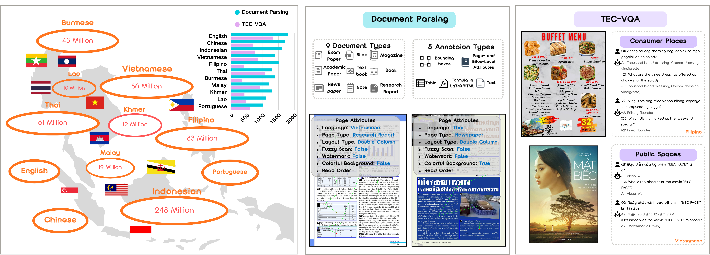
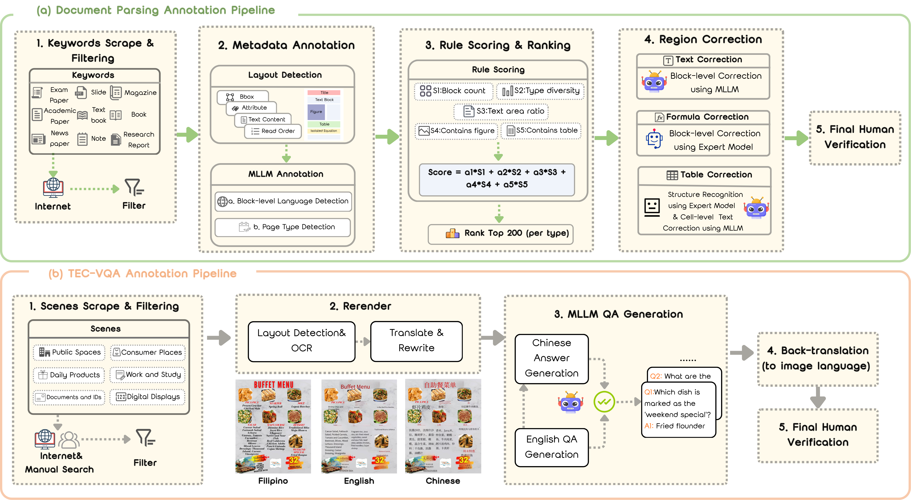

# SEA-Vision

**SEA-Vision: A Multilingual Benchmark for Comprehensive Document and Scene Text Understanding in Southeast Asia**

[](https://arxiv.org/abs/2603.15409)
[](https://swagger-coder.github.io/sea-vision-page/)
[](https://huggingface.co/datasets/xingranzhao/SEA-Vision)

SEA-Vision bundles two complementary benchmarks for evaluating multilingual visual document understanding across **11 Southeast-Asian languages** (EN / ZH / VI / TH / FIL / MS / ID / LO / KM / MY / PT):

| Sub-benchmark    | Task                                                                                          | Where it lives                              |
| ---------------- | --------------------------------------------------------------------------------------------- | ------------------------------------------- |
| **SEA-DocBench** | End-to-end document parsing — text blocks, display formulas, tables, reading order.          | [`SEA-DocBench/`](./SEA-DocBench/README.md) |
| **TEC-VQA**      | Text-centric visual question answering on natural-scene and document images.                  | [`TEC-VQA/`](./TEC-VQA/README.md)           |

---

## Benchmark Overview

<p align="center">
  
</p>

> Geographical language coverage and dataset scale (left), Document Parsing types and sample page attributes (middle), and TEC-VQA examples across consumer places and public spaces (right).

---

## Annotation Pipelines

<p align="center">
  
</p>

**(a) Document Parsing Annotation Pipeline:** Internet-sourced document pages are collected via domain-specific keywords and filtered for quality. Metadata annotation includes layout detection and MLLM-based language / page-type identification. Candidate pages are ranked by a rule-based scoring function (block count, type diversity, text-area ratio, presence of figures/tables). Selected samples undergo region-level correction via specialized models for text, formulas, and tables, followed by final human verification.

**(b) TEC-VQA Annotation Pipeline:** Scene images from diverse environments (public spaces, consumer places, documents, etc.) are gathered and filtered. Layout and text are detected and re-rendered with multilingual content. An MLLM first generates English QA pairs; the English questions are translated into Chinese and aligned for consistency. The bilingual QA pairs are then translated into the image language and manually verified.

---

## Model Performance

<p align="center">
  
</p>

> (a) End-to-end text recognition performance for Document Parsing across 11 languages. (b) TEC-VQA accuracy by language and model, along with overall averages. Models that perform well on high-resource languages (EN, ZH) degrade substantially on low-resource SEA scripts.

---

## Dataset Statistics

| Benchmark        | Scale                     | Languages | Annotation granularity                                           |
| ---------------- | ------------------------- | --------- | ---------------------------------------------------------------- |
| **SEA-DocBench** | 15,234 pages, 9 doc types | 11        | Page / block (243,643 regions) / line level; reading order       |
| **TEC-VQA**      | 1,839 images, 7,496 QA pairs | 11     | 5 capability labels: recognition, calculation, comparison, logical reasoning, spatial understanding |

---

## Repository Layout

```
SEA-Vision/
├── README.md                          (this file)
├── assets/                            Figures referenced in this README
│   ├── overview.png
│   ├── main.png
│   └── motivation2.png
│
├── SEA-DocBench/                      Document parsing benchmark + Dolphin reference inference
│   ├── README.md
│   ├── pdf_validation.py              Evaluation entrypoint
│   ├── configs/end2end_dolphin.yaml   Example end-to-end evaluation config
│   ├── tools/model_infer/             Reference inference scripts (Dolphin)
│   ├── dataset/ task/ metrics/ ...    Evaluation framework
│   └── data/                          (user-provided GT JSON + images, git-ignored)
│
├── TEC-VQA/                           Text-centric VQA benchmark
│   ├── README.md
│   ├── qa_eval/                       Inference + accuracy scripts (vLLM / API / acc.py)
│   └── data/                          (user-provided QA jsonl + images, git-ignored)
│
└── SEA-DocBench-images.tar.gz         Released image archive for SEA-DocBench (≈14 GB, distributed separately)
```

Both `SEA-DocBench/data/` and `TEC-VQA/data/` are kept as empty placeholders in version control. Actual datasets are distributed on Hugging Face — see the per-task READMEs for download commands.

---

## Common Installation

A single Python ≥ 3.10 environment can host both benchmarks:

```bash
python -m venv .venv
source .venv/bin/activate
pip install -U pip

# SEA-DocBench evaluation framework
pip install -r SEA-DocBench/requirements.txt

# TEC-VQA inference (any subset you need)
pip install vllm openai google-generativeai tqdm
```

PyTorch / CUDA wheels are not pinned in either `requirements.txt` — install the build that matches your driver, for example:

```bash
pip install torch torchvision --index-url https://download.pytorch.org/whl/cu121
```

---

## Quickstart

### 1. SEA-DocBench (document parsing)

```bash
cd SEA-DocBench

# (a) Place data — see SEA-DocBench/README.md for the GT JSON schema
#     data/ground_truth.json
#     data/images/*.jpg

# (b) Run reference inference (Dolphin); weights auto-download from HF on first use
python tools/model_infer/Dolphin_img2md.py \
    --input-dir   ./data/images \
    --save-dir    ./outputs/dolphin \
    --model-id    ByteDance/Dolphin-1.5 \
    --max-batch-size 16

# (c) Evaluate
python pdf_validation.py --config configs/end2end_dolphin.yaml
```

Per-element metrics (Edit_dist / TEDS / CDM_plain / …) are written to `SEA-DocBench/metrics/result/`. Full instructions: [`SEA-DocBench/README.md`](./SEA-DocBench/README.md).

### 2. TEC-VQA (text-centric VQA)

```bash
cd TEC-VQA

# (a) Place data — see TEC-VQA/README.md for the QA jsonl schema
#     data/all_qa_data.jsonl
#     data/images/<lang>/...

# (b) Run inference (vLLM example with Qwen / InternVL / Ovis)
cd qa_eval
python vllm_qwen_intern_ovis_batchQA.py \
  --model_dir /path/to/your/model \
  --input_jsonl ../data/all_qa_data.jsonl \
  --image_base_dir ../data/images \
  --output_jsonl ../data/qa_results/<model_name>.jsonl

# (c) Evaluate accuracy
python acc.py ../data/qa_results --mode md
```

API-based inference (OpenAI, Gemini) and MiniCPM-V-4_5 each have their own scripts under `TEC-VQA/qa_eval/`. Full instructions: [`TEC-VQA/README.md`](./TEC-VQA/README.md).

---

## Data Distribution

All benchmark data is hosted on Hugging Face at **[`xingranzhao/SEA-Vision`](https://huggingface.co/datasets/xingranzhao/SEA-Vision)**:

| Artefact                                              | Sub-benchmark    | How to obtain                                                                                                          |
| ----------------------------------------------------- | ---------------- | ---------------------------------------------------------------------------------------------------------------------- |
| `SEA-DocBench-images.tar.gz` (≈14 GB, 15,234 images) | SEA-DocBench     | `huggingface-cli download xingranzhao/SEA-Vision SEA-DocBench-images.tar.gz --repo-type dataset --local-dir .`        |
| Ground-truth JSON                                     | SEA-DocBench     | See [`SEA-DocBench/README.md`](./SEA-DocBench/README.md) for the schema.                                              |
| `all_qa_data.jsonl` (QA pairs)                        | TEC-VQA          | Ships with this repo at `TEC-VQA/data/all_qa_data.jsonl` — no separate download needed.                               |
| `images_11langs.tar.gz` (≈1.9 GB)                    | TEC-VQA          | `huggingface-cli download xingranzhao/SEA-Vision images_11langs.tar.gz --repo-type dataset --local-dir TEC-VQA/data`  |

---

## Citation

```bibtex
@inproceedings{yue2026seavision,
  title={SEA-Vision: A Multilingual Benchmark for Comprehensive Document and Scene Text Understanding in Southeast Asia},
  author={Yue, Pengfei and Zhao, Xingran and Chen, Juntao and Hou, Peng and Longchao, Wang and Lin, Jianghang and Zhang, Shengchuan and Zeng, Anxiang and Cao, Liujuan},
  booktitle={Proceedings of the IEEE/CVF Conference on Computer Vision and Pattern Recognition (CVPR)},
  year={2026}
}
```

---

## License & Acknowledgements

- `SEA-DocBench/` is released under the Apache License 2.0 (see `SEA-DocBench/LICENSE`). It builds on the evaluation framework from [OmniDocBench](https://github.com/opendatalab/OmniDocBench), and the reference Dolphin inference helpers (vendored under `SEA-DocBench/tools/model_infer/dolphin_utils/`) are MIT-licensed by ByteDance ([github.com/bytedance/Dolphin](https://github.com/bytedance/Dolphin)). Model weights: [ByteDance/Dolphin-1.5](https://huggingface.co/ByteDance/Dolphin-1.5).
- `TEC-VQA/` license will be finalised at the official open-source release. Until then, please use the code and data for academic research only and comply with each upstream model / API / data-source's terms of use.

---

## Contact

Issues and pull requests are welcome. For questions about either sub-benchmark, please file an issue or contact the repository maintainers.
